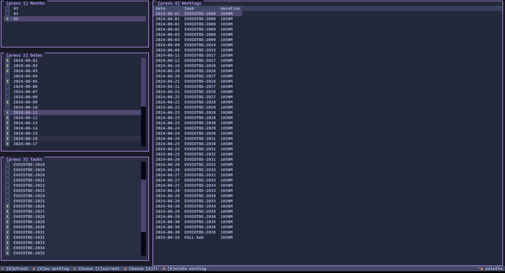

# Description
Minimalistic Terminal UI app. Inspired by lazygit.


# Build
```pyinstaller --onefile --add-data "lazy_worklog_tracker/css;lazy_worklog_tracker/css" app.py```
# Local development
```textual run --dev app.py```
